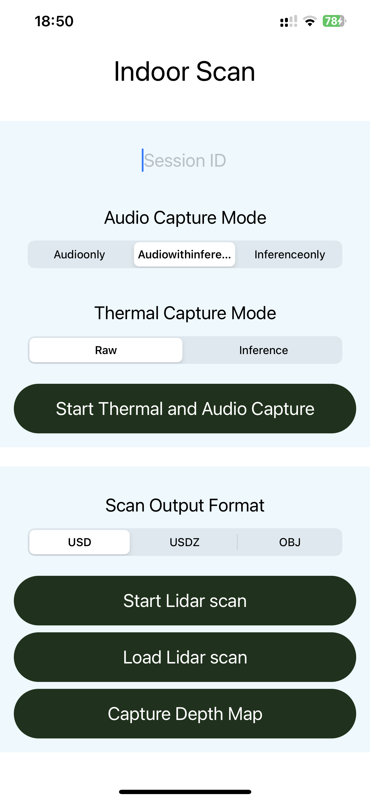
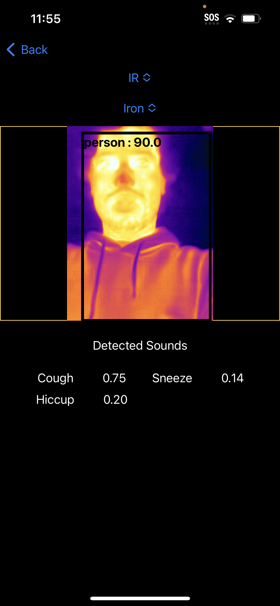
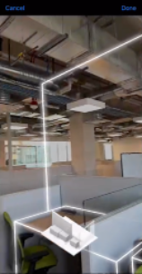
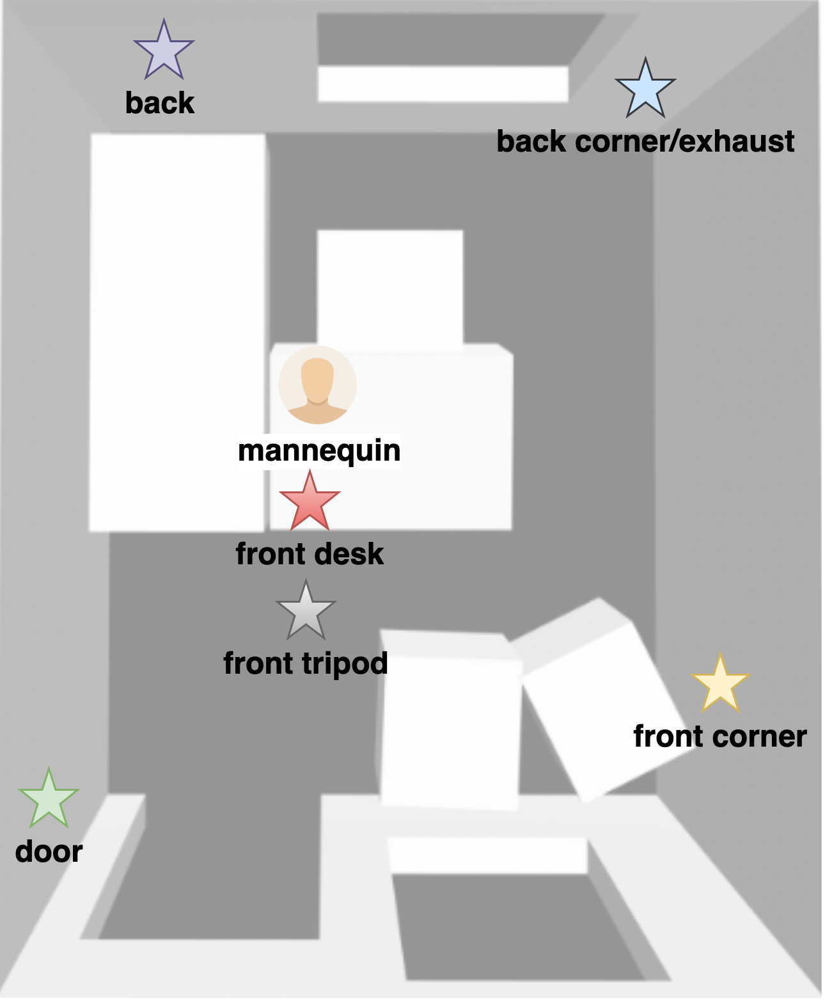
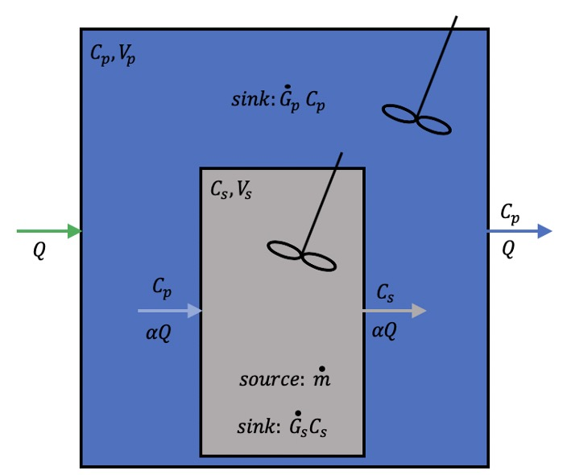

## Modeling and Simulation of Aerosol Flow with Mobile Sensors
## Introduction
**Motivation**:
Indoor air quality is very important when it comes to ensuring the safety and comfort of individuals in a variety of settings. However, the existing air quality monitoring systems are often costly and do not fully consider risks assoiated with respiratory droplets and aerosols. Therefore, a tool that can provide information regarding the duration of exposure to resporatory aerosols would prove to be incredibly beneficial. By utilizing such a tool, individuals and organizations would be better equipped to make informed decisions regarding the safety of indoor environments, thereby minimizing the risk of respiratory infections and promoting overall health and well-being.

**Goals**:
In this project, we aim to develop application to monitor resident time of human respiratory aerosols in indoor environment utilizing mobile sensors and machine learning models, with the aim of improving the safety of people, especially in high-risk environment such as hospitals, healthcare facilities, and classrooms. The app will capture syndromic signal such as cough and provide dinformation to optimize safety in dynamic real world setting and use cost effective and accessible to the general public.

## Methods
### Data Collection APP Development
We developed iOS application for collection of data and proof of concept deployment of models. \\
Our app includes features such as: 
* **Audio**: capture and classify audio to detect events such as cough, sneeze
* **Thermal Image**: using a FLIR one camera to detect surface temperatures, and detect human presence, and movement in the thermal image using YOLO model
* **Lidar and Camera**: capture room layout info and geomtry required for modeling and CFD simulation
* **Database**: store collected data online using Firebase

<table><tr>
<td>  </td>
<td>  </td>
<td>  </td>

APP Content View

</tr></table>

<iframe width="800" height="450" src="https://youtu.be/suGByOBXNN8" title="APP demo" frameborder="0" allow="accelerometer; autoplay; clipboard-write; encrypted-media; gyroscope; picture-in-picture" allowfullscreen></iframe>

### Data Collection Process
We established a test environment in a compact office space (approx. dimenisions - 3.2m, 2.6m, 3.2m), where we mechanically simulated human coughs and captured aerosol concentrations using particulate matter (PM) sensors. The cough simulation involved a mannequin, mechanical ventilator, fog machine, and air compressor. To measure the actual particle concentration in the room, we installed six PM sensors.
<table><tr>
<td>
<!-- Import the component -->

<!-- Use it like any other HTML element -->

<model-viewer alt="Model of Data Collection Room Setting Produced from LiDAR" src="assets/Uc302.gltf" ar shadow-intensity="1" camera-controls touch-action="pan-y">
</model-viewer>
</td>
<td>  
</td>
</tr></table>

<figcaption align = "center"><b> Data Collection Environment with Cough Simulation Mannequin</b></figcaption>

### Data visualization

#### Exploratory Data Analysis 
Our exploratory data visualization has revealed that the dispersion and duration of aerosol concentrations at various sensor locations varies under different fan speed settings during a cough event. 

<table>
<caption>Impact of Fan Speed and Sensor Location on Aerosol Concentrations </caption>
<tr>
<td>   </td>
<td>  </td>
</tr>
</table>
<table>
<tr>
<td>  </td>
<td>  </td>
</tr>
</table>

To better illustrate these differences, we used a log scale graph and an aerosol concentration at exhaust location graph for comparison. We observed that in the absence of air conditioning, aerosols tend to persist in a room for a longer time and disperse and disappear at a slower rate than when the fan is turned on. Furthermore, under high-speed fan settings, aerosol concentration is lower and disperses faster than under low-speed settings. This suggests that the air exchange rate in the room plays a critical role in the changes in aerosol concentration.

The following animation helps to visualize how the aerosol concentration in a room changes after a cough event.



We also conducted experiments under three different room conditions. The first one involved leaving the door open during the cough simulation event. The second condition involved keeping the door closed during the cough simulation event. In the third condition, the door was closed during the cough simulation event and then opened afterward. We discovered that air flow also plays a crucial role in the changes in aerosol concentration. When the door is open, the aerosol concentration is significantly lower than when the door is closed, which suggests that the exchange of air with the surrounding environment can help to reduce the concentration of aerosols in the room.

##  Modeling and Simulations

### Compartment Model
We utilized the compartment model to forecast the aerosol concentration, but for simplicity, we neglected the sinks (settling) factor and focused solely on the aerosol concentration in the perfectly mixed parent compartment.
<table>
<tr><td>
<table>
  <tr>
    <th>Variable</th>
    <th>Description</th>
  </tr>
  <tr>
    <td> <math><msub><mi>V</mi><mi>p</mi></msub></math></td>
    <td> Volume of parent compartment</td>
  </tr>
  <tr>
    <td><math><msub><mi>V</mi><mi>s</mi></msub></math></td>
    <td> Volume of sub-compartment</td>
  </tr>
  <tr>
    <td><math><mi>Q</mi></math></td>
    <td> Room air exchange rate</td>
  </tr>
  <tr>
    <td><math><msub><mi>C</mi><mi>p</mi></msub></math></td>
    <td> Aerosol concentration in the perfectly mixed parent compartment</td>
  </tr>
  <tr>
    <td><math><msub><mi>C</mi><mi>s</mi></msub></math></td>
    <td> Aerosol concentration in the perfectly mixed sub-compartment</td>
  </tr>
  <tr>
    <td><math><mi>α</mi></math></td>
    <td> Compartment coupling coefficient</td>
  </tr>
  <tr>
    <td><math><mi>t</mi></math></td>
    <td> Time</td>
  </tr>
  <tr>
    <td><math><msub><mi>G</mi><mi>p</mi></msub></math></td>
    <td> Settling rate factor in parent compartment</td>
  </tr>
  <tr>
    <td><math><msub><mi>G</mi><mi>s</mi></msub></math></td>
    <td> Settling rate for factor in sub-compartment</td>
  </tr>
</table> </td>
<td>  </td>
</tr>
</table> 

### Model Prediction

### Computational Fluid Dynamics Simulation 
Aside from modeling, we also utilized professional simulation software to validate our data collection process, especially the locations where we should put the PM sensors. The software is Ansys Discovery, a computational fluid dynamics simulation tool that can model airflows in an enclosed space. From the figure below, it is clear that when airflow attempts to pass through the different furnitures in the room, the air is likely to be disrupted and form a vortex which can have temporarily increased aerosol concentration in the room. The simulation serves as an extra data source for us to make sure that we are doing things correctly. However, due to our limited knowledge about CFD, the simulation setting still needs some work before being able to simulate actual coughing. As of right now, the software provides us with an opportunity to examine the possible airflow conditions in the test room.

## Conclusion & Discussion
For this project, we have developed models using measured sensor data and simulation data to develop robust models to predict aerosol resident time, and we also performed experiments on human subjects to. In the future, we will continue to improve the model’s accuracy in incorporating sound labels and subject movement.

## Reference
[1] Rahman, Tauhidur. Modeling indoor Air quality and Aerosol Transport with Simulation Digital Twins, 2022. University of California, San Diego.
