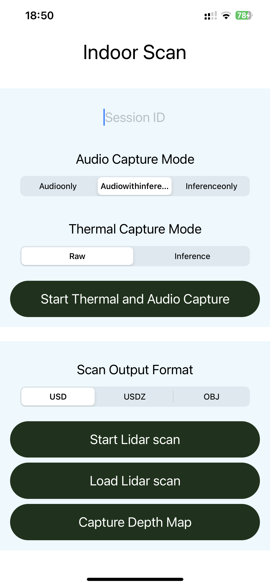
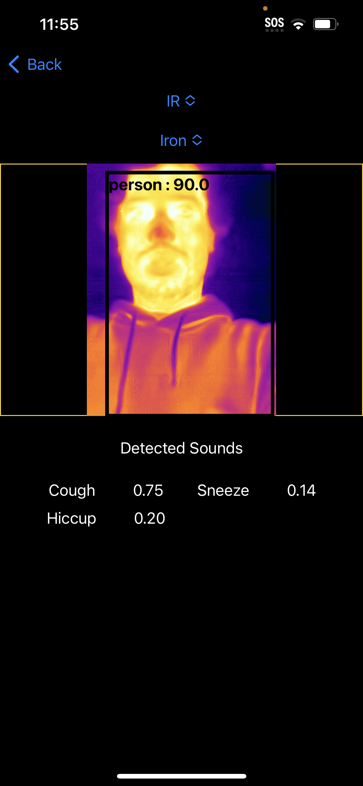
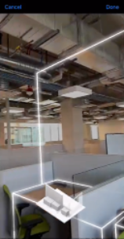
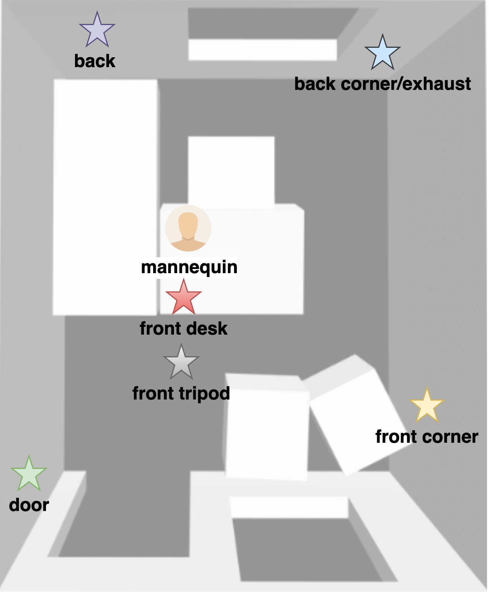

## Modeling and Simulation of Aerosol Flow with Mobile Sensors
## Team Members: Zixin Ma, Jiali Qian, Yidan Wang 
## Mentors: Professor Tauhidur Rahman, PhD Tanjid Hasan Tonmoy

### Introduction
Motivation:
Indoor air quality is very important when it comes to ensuring the safety and comfort of individuals in a variety of settings. However, the existing air quality monitoring systems are often costly and do not fully consider risks assoiated with respiratory droplets and aerosols. Therefore, a tool that can provide information regarding the duration of exposure to resporatory aerosols would prove to be incredibly beneficial. By utilizing such a tool, individuals and organizations would be better equipped to make informed decisions regarding the safety of indoor environments, thereby minimizing the risk of respiratory infections and promoting overall health and well-being.

Goals:
In this project, we will develop application to monitor resident time of human respiratory aerosols in indoor environment utilizing mobile sensors and machine learning models, with the aim of improving the safety of people, especially in high-risk environment such as hospitals, healthcare facilities, and classrooms. We created the app that can help us to capture syndromic signal such as cough and provide dinformation to optimize safety in dynamic real world setting and use cost effective and accessible to the general public.

### Methods
#### Data Collection APP Development:
We developed iOS application for collection of data and proof of concept deployment of models. \\
Our app includes features such as: 
* **Audio**: capture and classify audio to detect events such as cough, sneeze
* **Thermal Image**: using a FLIR one camera to detect surface temperatures, and detect human presence, and movement in the thermal image using YOLO model
* **Lidar and Camera**: capture room layout info and geomtry required for modeling and CFD simulation
* **Database**: store collected data online using Firebase

<table><tr>
<td>  </td>
<td>  </td>
<td>  </td>

APP Content View

</tr></table>

<iframe width="800" height="450" src="https://youtu.be/suGByOBXNN8" title="APP demo" frameborder="0" allow="accelerometer; autoplay; clipboard-write; encrypted-media; gyroscope; picture-in-picture" allowfullscreen></iframe>

#### Data Collection Process
We have the testbed setup in a small office room, and we simulated human coughs mechanically using a mannequin, mechanical ventilator, fog machine, and the air compressor. 
There were six PM sensors set up to measure actual particle concentration in the room.
<table><tr>
<td>
<!-- Import the component -->

<!-- Use it like any other HTML element -->

<model-viewer alt="Model of Data Collection Room Setting Produced from LiDAR" src="assets/Uc302.gltf" ar shadow-intensity="1" camera-controls touch-action="pan-y">
</model-viewer>
</td>
<td>  
</td>
</tr></table>

<figcaption align = "center"><b>Fig[3]: Data Collection Environment with Cough Simulation Mannequin</b></figcaption>

### Data visualization

##### Exploratory Data Analysis 
<table>
<!-- <caption>Monthly savings</caption>-->
<tr>
<td>   </td>
<td>  </td>
</tr>
</table>

<table>
<tr>
<td>  </td>
<td>  </td>
</tr>
</table>



####  Modeling and Simulations

### Conclusion & Discussion
For this project, we have developed models using measured sensor data and simulation data to develop robust models to predict aerosol resident time, and we also performed experiments on human subjects to. In the future, we will continue to improve the model’s accuracy in incorporating sound labels and subject movement.

### Reference
[1] Rahman, Tauhidur. Modeling indoor Air quality and Aerosol Transport with Simulation Digital Twins, 2022. University of California, San Diego.
